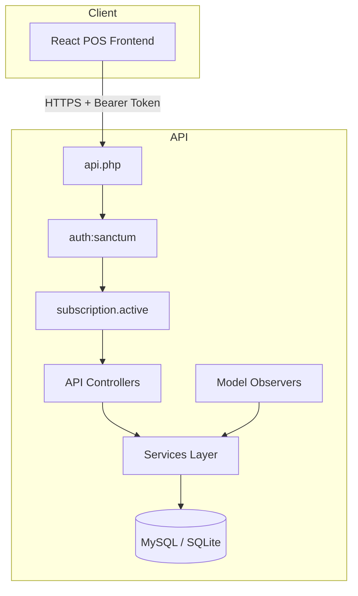
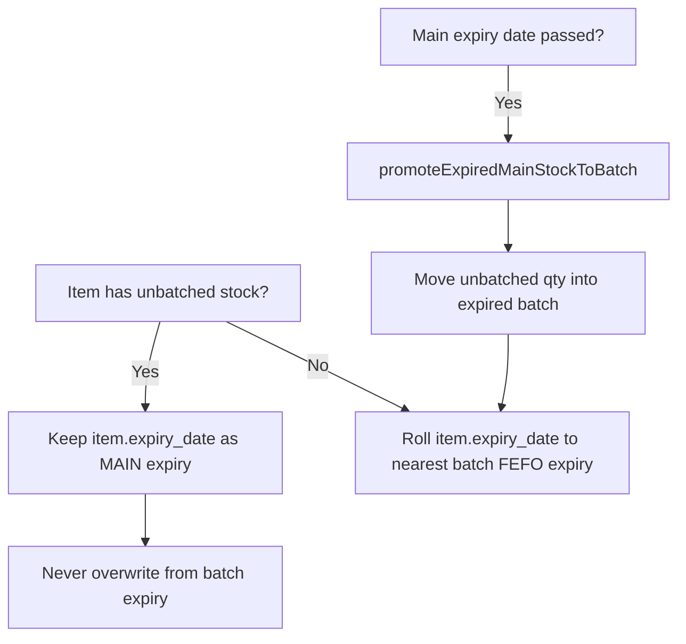

# POS System

A full-stack **Point of Sale (POS)** and inventory management platform for retail and wholesale businesses. The system supports multi-branch stock, batch-aware inventory with expiry tracking, stacked promotional offers, sales/purchases, backups, role-based access control, and subscription-gated API access.

---

## Table of Contents

- [**Complete setup guide (START HERE)**](SETUP.md)
- [Overview](#overview)
- [Repository Structure](#repository-structure)
- [Technology Stack](#technology-stack)
- [Quick Start](#quick-start)
- [Architecture](#architecture)
- [Security Model](#security-model)
- [Core Business Logic](#core-business-logic)
  - [Main Stock vs Batch Stock](#main-stock-vs-batch-stock)
  - [Expiry Date Rules](#expiry-date-rules)
  - [Purchase Stock Routing](#purchase-stock-routing)
  - [Sales & Stock Deduction (FEFO)](#sales--stock-deduction-fefo)
  - [Offers (Stacked Discounts)](#offers-stacked-discounts)
  - [Multi-Location / Branches](#multi-location--branches)
- [Main Modules](#main-modules)
- [Key Backend Services](#key-backend-services)
- [API Access Layers](#api-access-layers)
- [Frontend (POS UI)](#frontend-pos-ui)
- [Backup & Restore](#backup--restore)
- [Environment Variables](#environment-variables)
- [Deployment Notes](#deployment-notes)
- [Further Documentation](#further-documentation)

---

## Overview

| Layer | Path | Description |
|-------|------|-------------|
| **Backend API** | `backend/` | Laravel REST API — auth, inventory, sales, purchases, offers, reports, settings |
| **Frontend** | `sky-sample-website-frontend/` | React + TypeScript + Vite SPA — POS screens, inventory, settings |
| **Docs / tooling** | `docs/` | Internal documentation utilities |

Each company’s data is scoped by `company_id`. Users authenticate with **Laravel Sanctum** bearer tokens. Most POS routes require an **active subscription** in addition to authentication.

---

## Repository Structure

```
POS/
├── backend/                          # Laravel API
│   ├── app/
│   │   ├── Http/Controllers/Api/     # REST controllers
│   │   ├── Http/Middleware/          # Subscription gate, etc.
│   │   ├── Models/                   # Eloquent models
│   │   ├── Observers/                # e.g. ItemBatchObserver → expiry sync
│   │   └── Services/                 # Business logic layer
│   ├── database/migrations/          # Schema migrations
│   ├── routes/api.php                # API route definitions
│   └── storage/app/backups/          # SQL backup files (runtime)
│
└── sky-sample-website-frontend/      # React POS client
    └── src/
        ├── api/                      # Axios API clients
        ├── views/POS/                # POS screens (sales, inventory, …)
        ├── components/               # Shared UI (Sidebar, layout, …)
        └── hooks/                    # Auth & permission hooks
```

---

## Technology Stack

### Backend
- **PHP 8.2+**, **Laravel 12**
- **MySQL** (primary) or SQLite (development)
- **Laravel Sanctum** — API token authentication
- **Eloquent ORM** — data access with company scoping

### Frontend
- **React 18**, **TypeScript**, **Vite 6**
- **Material UI (MUI) 6**
- **TanStack React Query** — server state
- **Axios** — HTTP client
- **React Router 7** — routing

---

## Quick Start

> **Full step-by-step install (Windows + production):** see **[SETUP.md](SETUP.md)**

### 1. Backend

```bash
cd backend
cp .env.example .env
# Edit .env: DB_DATABASE, DB_USERNAME, DB_PASSWORD

composer install
php artisan key:generate
php artisan migrate
php artisan storage:link
php artisan serve
```

API base URL: `http://localhost:8000/api`

### 2. Frontend

```bash
cd sky-sample-website-frontend
cp .env.example .env
# Set VITE_API_BASE_URL=http://localhost:8000

npm install
npm run dev
```

### 3. Login

```bash
curl -X POST http://localhost:8000/api/auth/login \
  -H "Content-Type: application/json" \
  -d '{"email":"user@example.com","password":"yourpassword"}'
```

Use the returned `token` as `Authorization: Bearer <token>` on protected routes.

---

## Architecture



**Request flow:** `Route → Middleware → Controller → Service → Model/DB`

Business rules live in **Services** (not controllers), keeping inventory, sales, and expiry logic centralized and testable.

---

## Security Model

### Authentication

| Mechanism | Details |
|-----------|---------|
| **Registration / Login** | `POST /api/auth/register`, `POST /api/auth/login` |
| **Tokens** | Laravel Sanctum personal access tokens (`POS-APP`) |
| **Password storage** | Bcrypt hashing (`BCRYPT_ROUNDS=12`) |
| **Logout** | Revokes current token (`POST /api/auth/logout`) |
| **Profile** | `GET /api/auth/profile` — includes resolved permissions |

### Authorization (RBAC)

- Users belong to a **company** (`company_id`) and a **role** (`roleModel`).
- `PermissionService` maps role permissions → POS menu keys (`pos.sales`, `pos.inventory`, `pos.settings`, etc.).
- **Admins** (`slug === 'admin'` or permission `*`) get full access.
- Frontend uses `useCurrentUserHaveAccess` and sidebar `pos_access` flags to hide unauthorized menus.
- Sensitive operations (e.g. **database backup/restore**) require **admin** or **users.manage** permission.

### Subscription Gate

- Middleware: `EnsureSubscriptionPaid` (`subscription.active`)
- Blocks POS features when monthly subscription is overdue (HTTP **402**).
- Auth and subscription payment routes remain available so users can pay and recover access.

### Activity & Audit

- **Login / logout** logged with IP and user agent (`ActivityLogService`).
- Company admins can view staff login history (`GET /api/auth/login-history`).

### POS Transaction Security

| Control | Service | Behavior |
|---------|---------|----------|
| Hold order PIN | `OrderTransactionService` | PIN required to modify held orders; PIN never returned to client |
| Refund card verify | `OrderTransactionService` | Last 4 digits of card required for returns when enabled |
| Past-date sales | `OrderTransactionService` | Blocked when disabled in order settings |
| Price edit lock | `OrderTransactionService` | Selling price locked to item master when disabled |
| Negative inventory | `OrderTransactionService` / `LocationService` | Configurable per order settings |

### Data Isolation

- All inventory, sales, purchases, customers, etc. are filtered by **`company_id`** in services.
- API controllers never trust client-supplied company IDs; the authenticated user’s company is used.

### Backup Security

- Backup list/create/upload/download/restore/delete: **admin only** (`BackupService::assertCanManageBackups`).
- Filenames validated with strict regex to prevent path traversal.
- Upload size capped (200 MB).

### API / Transport

- Use **HTTPS** in production (`APP_URL`, `VITE_API_BASE_URL`).
- Configure **CORS** and **Sanctum stateful domains** for your frontend origin (see `backend/.env.example`).
- Request validation on all write endpoints via Laravel `validate()`.

---

## Core Business Logic

### Main Stock vs Batch Stock

The system distinguishes two stock types per item per branch:

| Type | Storage | When used |
|------|---------|-----------|
| **Main (unbatched)** | `items.qty` minus sum of `item_batches.qty` | Opening stock on item create; purchases matching item master price **and** expiry |
| **Batch** | `item_batches` rows | Purchases with **different** purchase price or expiry; manual batch create |

```
Total item qty = batch qty + unbatched qty
```

**Item create:** `qty`, `purchase_price`, and `expiry_date` on the item record represent **main/unbatched** stock. No opening batch is created automatically.

### Expiry Date Rules

Handled primarily by:

- `ItemExpirySyncService` — sync & promote logic
- `ItemService::resolveExpiryFields()` — API display fields
- `BatchStockService` — purchase routing
- `LocationService` — sale deduction



#### Display fields (API / UI)

| Field | Meaning |
|-------|---------|
| `expiry_date` | Item master expiry (main stock) |
| `main_expiry_date` | Shown when `unbatched_qty > 0` |
| `nearest_batch_expiry_date` | Nearest in-stock batch expiry (FEFO) |
| `nearest_batch_expiry_qty` | Qty in batches at that nearest expiry |
| `unbatched_qty` | Main stock quantity |
| `nearest_expiry_date` | Primary display expiry (main first, else batch) |

#### UI behavior (`ItemExpiryChip`)

- **Main stock exists:** `Main {date} · {qty}`
- **Batch stock exists:** `Batch {date} · {qty}` (shown below main)
- **Main sold out:** only batch line remains
- **Same expiry on purchase:** no new batch — qty merges into main

### Purchase Stock Routing

`BatchStockService::applyPurchaseStock()`:

1. Resolves item at purchase **branch/location**
2. Compares purchase line **unit price** and **expiry date** to item master
3. **Match** → `addPurchaseToMainItemQty()` (unbatched, no batch)
4. **No match** → `addPurchaseBatchStock()` (creates or merges batch)

Matching rules (`matchesMainItemPurchase`):

- Expiry dates normalized to `Y-m-d` before compare
- Purchase price within `0.005` of item `purchase_price`
- Main expiry must not already be past
- If item has unbatched stock but no expiry yet, first same-price purchase can set main expiry

### Sales & Stock Deduction (FEFO)

`LocationService::deductStockFefo()`:

1. **Main (unbatched) stock is sold first**
2. Remaining quantity deducted from **batches** nearest expiry first (FEFO)
3. Batches without expiry sell after dated batches
4. Specific batch can be selected in POS batch dialog (`item_batch_id` on sale line)

After each deduction, `ItemExpirySyncService::syncFromBatches()` updates item expiry display.

### Offers (Stacked Discounts)

- **Product offers** and **order offers** can stack (not “best one only”).
- `OrderTransactionService` applies primary offer, then searches for a complementary opposite-type offer.
- `OfferDiscountService` respects **batch restrictions** (`offer_item_batches`) when offers are batch-specific.
- Frontend: `useSaleOfferEngine.ts`, `posProductOffers.ts` mirror backend preview logic.

### Multi-Location / Branches

- Items are keyed by `item_number` + `location` (branch).
- `LocationService::resolveStockItemAtLocation()` finds or creates a branch row for the same product.
- Purchases and sales apply stock at the selected branch.
- Inventory breakdown API returns variants per branch plus all batches.

---

## Main Modules

| Module | Backend | Frontend | Description |
|--------|---------|----------|-------------|
| **Dashboard** | `PosDashboardController` | `views/POS/dashboard` | Live sales metrics |
| **Sales / POS** | `SaleController`, `SaleService` | `views/POS/sales` | Checkout, hold orders, returns, batch select |
| **Items** | `ItemController`, `ItemService` | `views/POS/inventory` | Product master, categories |
| **Inventory** | `ItemInventoryService` | `ItemBatchVariantsPanel`, write-off | Batches, variants, movements |
| **Purchases** | `PurchaseController`, `BatchStockService` | Purchasing screens | Supplier invoices, stock in |
| **Customers** | `CustomerController` | Customer management | CRM, credit |
| **Suppliers** | `SupplierController` | Supplier screens | Vendor master |
| **Payments** | `PaymentController` | Payments | Customer payments |
| **Expenses** | `ExpenseController` | Expenses | Operating costs |
| **Offers** | `OfferController`, `OfferService` | Offers UI | Promotions |
| **Reports** | `ReportController` | Reports | Sales, inventory reports |
| **Settings** | Multiple `*SettingController` | Settings tabs | Company, tax, order, hardware, backup |
| **Users & Roles** | `UserController`, `RoleController` | User management | Staff accounts, permissions |
| **Repair** | `RepairController` | Repair module | Repair location stock transfers |
| **Shipping** | `ShipmentController` | Shipping | Outbound shipments |
| **Alerts** | `SystemAlertService` | Notifications | Low stock, expiry, held orders |
| **Backup** | `BackupController`, `BackupService` | `BackupSettings` | DB backup / restore |

---

## Key Backend Services

| Service | Responsibility |
|---------|----------------|
| `ItemService` | Item CRUD, formatting, expiry field resolution, stock meta |
| `ItemInventoryService` | Manual stock add, write-off, batch CRUD, inventory breakdown |
| `BatchStockService` | Purchase → main vs batch routing |
| `ItemExpirySyncService` | Main expiry preservation, expired main → batch promotion |
| `LocationService` | Branch stock resolve, FEFO sale deduction |
| `SaleService` | Sales CRUD, receipt, hold orders |
| `OrderTransactionService` | Sale validation, offers, PIN, pricing rules |
| `OfferDiscountService` | Offer application & preview |
| `PurchaseService` | Purchase documents & stock application |
| `PermissionService` | Role → POS access resolution |
| `BackupService` | mysqldump / PHP fallback dump, restore |
| `ActivityLogService` | Login audit trail |
| `SubscriptionService` | Subscription status & payment gate |

---

## API Access Layers

```
Public
  POST /api/auth/register
  POST /api/auth/login

Authenticated (auth:sanctum)
  POST /api/auth/logout
  GET  /api/auth/profile
  GET  /api/subscription/status
  POST /api/subscription/pay

Subscription required (auth:sanctum + subscription.active)
  /api/sales/*
  /api/items/*
  /api/purchases/*
  /api/offers/*
  /api/settings/*
  … (full POS — see backend/routes/api.php)
```

---

## Frontend (POS UI)

### POS Sales flow

1. Load catalog via `GET /api/items?for_pos_sale=1`
2. Add lines — optional **batch selection** (`PosSaleBatchSelectDialog`)
3. Offer engine auto-resolves product + order discounts
4. Checkout → `POST /api/sales`
5. Backend deducts stock (main first, then FEFO batches)

### Permission-aware navigation

`Sidebar.tsx` uses `pos_access` from the user profile. Nested menus auto-open for the active route.

### Inventory display

- `ItemExpiryChip` — main/batch expiry with quantities
- `ItemBatchVariantsPanel` — branch variants, unbatched rows, batch table

---

## Backup & Restore

**Settings → Backup** (admin only):

| Action | Endpoint |
|--------|----------|
| List backups | `GET /api/settings/backups` |
| Create backup | `POST /api/settings/backups` |
| Upload `.sql` | `POST /api/settings/backups/upload` |
| Download | `GET /api/settings/backups/{filename}/download` |
| Restore | `POST /api/settings/backups/{filename}/restore` |
| Delete | `DELETE /api/settings/backups/{filename}` |

MySQL backups use `mysqldump` when available, with a **PHP fallback** dump on hosts where `mysqldump` is missing or fails (e.g. some Windows TCP socket setups).

---

## Environment Variables

### Backend (`backend/.env`)

| Variable | Purpose |
|----------|---------|
| `APP_KEY` | Encryption key (required) |
| `DB_*` | Database connection |
| `POS_DATABASE_PER_TENANT` | `false` = single shared database |
| `APP_URL` | Backend public URL |
| `FRONTEND_URL` / `CORS_ALLOWED_ORIGINS` | CORS for SPA |
| `SANCTUM_STATEFUL_DOMAINS` | Sanctum cookie domains (if used) |

### Frontend (`sky-sample-website-frontend/.env`)

| Variable | Purpose |
|----------|---------|
| `VITE_API_BASE_URL` | Laravel API root (no `/api` suffix) |
| `VITE_BASE_PATH` | Subfolder deploy path (e.g. `/pos/`) |
| `VITE_APP_NAME` | Application title |

---

## Deployment Notes

1. Run migrations: `php artisan migrate --force`
2. Link storage: `php artisan storage:link`
3. Set `APP_DEBUG=false` in production
4. Point web server document root to `backend/public`
5. Build frontend: `npm run build` → serve `dist/` or copy to static host
6. Match `VITE_API_BASE_URL` to production API URL
7. Enable HTTPS and restrict backup/restore to trusted admins

---

## Further Documentation

| Document | Location |
|----------|----------|
| **Complete setup guide** | [SETUP.md](SETUP.md) |
| Backend quick reference | [backend/QUICK_REFERENCE.md](backend/QUICK_REFERENCE.md) |
| Backend API reference | [backend/API_DOCUMENTATION.md](backend/API_DOCUMENTATION.md) |
| Backend setup guide | [backend/BACKEND_SETUP.md](backend/BACKEND_SETUP.md) |
| Backend README | [backend/README.md](backend/README.md) |

---

## License

Proprietary / internal use — update this section if you publish under an open-source license.

---

**Built for retail POS operations with batch-aware expiry inventory, secure multi-user access, and branch-level stock control.**
